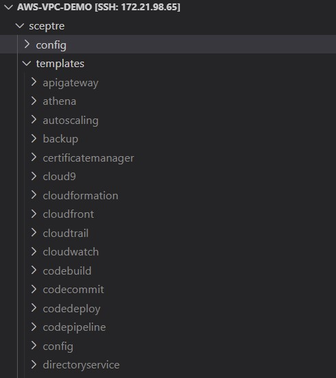

# README

This repo demonstrates how to deploy VPC to an AWS account using different ways presented in different subdirectories:

- [demo01a](sceptre/config/demo01a/): deploy VPC, Internet Gateway, Route Tables, Network ACL, and Subnets using template with static configuration in [vpc-a.yaml](sceptre/templates/vpc-a.yaml).
- [demo01b](sceptre/config/demo01b/): deploy VPC, Internet Gateway, Route Tables, Network ACL, and Subnets using template with parameterised configuration in [vpc-b.yaml](sceptre/templates/vpc-b.yaml).
- [demo02a](sceptre/config/demo02a/): deploy VPC, Internet Gateway, Route Tables, Network ACL, and Subnets using Jinja2 templates downloaded from GitHub repo named [shared-sceptre-template](https://github.com/harisfauzi/shared-sceptre-template).
- [demo02b](sceptre/config/demo02b/): deploy VPC, Internet Gateway, Route Tables, Network ACL, and Subnets using Jinja2 templates downloaded from GitHub repo named [shared-sceptre-template](https://github.com/harisfauzi/shared-sceptre-template), with advanced configuration to be deployed to different environment (staging, production).

## Requirements

- Admin/poweruser access to an AWS account.
- Bash environment, preferrably Linux instead of Windows WSL.
- Docker (optional), or Python 3.7.

## Deployment

### Step-by-step process:

1. Authenticate to AWS CLI environment. See https://docs.aws.amazon.com/cli/latest/userguide/cli-chap-configure.html. If your AWS account uses third party authentication such as Google, Azure, Okta Verify, Duo Mobile, etc please follow your own procedure.
2. Setup environment variables for AWS authentication. See https://docs.aws.amazon.com/cli/latest/userguide/cli-configure-envvars.html for full list of supported environment variables. The minimum is only these two:
    - AWS_PROFILE
    - AWS_DEFAULT_REGION
If you need to assume IAM role to switch to your target AWS account deployment, you may need to use the following environment variables:
    - AWS_ACCESS_KEY_ID
    - AWS_SECRET_ACCESS_KEY
    - AWS_SESSION_TOKEN
    - AWS_DEFAULT_REGION
3. Download [shared-sceptre-template](https://github.com/harisfauzi/shared-sceptre-template/archive/refs/tags/v0.1.3.zip) release 0.1.3 and extract it under sceptre. The extracted files should like .
4. Setup python virtual environment (optional), e.g.
    ```bash
    virtualenv -p /usr/bin/python3 .venv
    source .venv/bin/activate
    ```

5. Install scetpre and other python modules from the provided [requirements.txt](./requirements.txt):

    ```bash
    pip install -r requirements.txt
    ```

6. Run the following:

    To deploy *demo01a*:

        ```bash
        cd sceptre
        sceptre launch -y demo01a
        cd ..
        ```

    To deploy *demo01b*:

        ```bash
        cd sceptre
        sceptre launch -y demo01b
        cd ..
        ```

    To deploy *demo02a*:

        ```bash
        cd sceptre
        sceptre launch -y demo01a
        cd ..
        ```

    To deploy *demo02b* to *staging* environment:

        ```bash
        cd sceptre
        sceptre --var-file ./variables/staging-vars.yaml launch -y demo02b
        cd ..
        ```

    To deploy *demo02b* to *production* environment:

        ```bash
        cd sceptre
        sceptre --var-file ./variables/prod-vars.yaml launch -y demo02b
        cd ..
        ```


### Scripted process (like in Youtube demo):

Before you continue, make sure you have the following:
- Bash environment
- Docker

The procedure:

1. Authenticate to AWS CLI environment. See https://docs.aws.amazon.com/cli/latest/userguide/cli-chap-configure.html. If your AWS account uses third party authentication such as Google, Azure, Okta Verify, Duo Mobile, etc please follow your own procedure. Take note of the AWS profile names that you want to use for this deployment.

2. Setup environment variables for AWS authentication. See https://docs.aws.amazon.com/cli/latest/userguide/cli-configure-envvars.html for full list of supported environment variables. The minimum is only these two:
    - AWS_PROFILE
    - AWS_DEFAULT_REGION
If you need to assume IAM role to switch to your target AWS account deployment, you may need to use the following environment variables:
    - AWS_ACCESS_KEY_ID
    - AWS_SECRET_ACCESS_KEY
    - AWS_SESSION_TOKEN
    - AWS_DEFAULT_REGION

4. Run the following:

    To deploy *demo01a*:

        ```bash
        ./deploy-cfn.sh --dry-run false --action deploy --item demo01a
        ```

    To deploy *demo01b*:

        ```bash
        ./deploy-cfn.sh --dry-run false --action deploy --item demo01b
        ```

    To deploy *demo02a*:

        ```bash
        ./deploy-cfn.sh --dry-run false --action deploy --item demo02a
        ```

    To deploy *demo02b* to *staging* environment:

        ```bash
        ./deploy-cfn.sh --dry-run false --action deploy --var-file staging-vars.yaml --item demo02b
        ```

    To deploy *demo02b* to *production* environment:

        ```bash
        ./deploy-cfn.sh --dry-run false --action deploy --var-file prod-vars.yaml --item demo02b
        ```